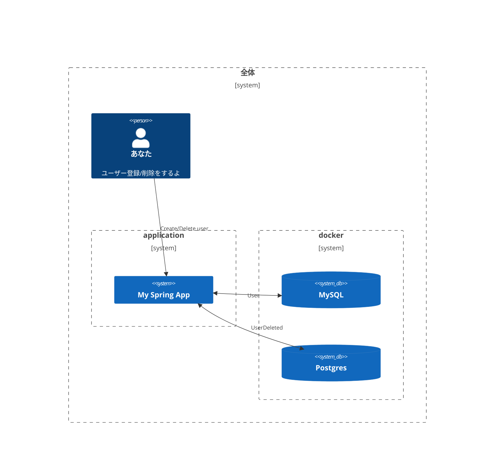
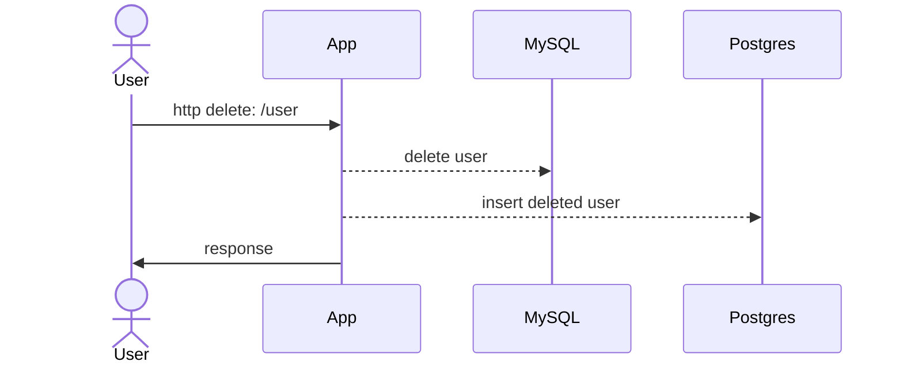

# 初級 データソースをH2からMySQLに変更する

Spring boot で何か作ろう超入門。

## 以前の記事

この記事は、下記のlessonを見ている前提で書いています。

- [lesson1: 超入門 Userを登録して、検索する](https://github.com/mzsima/first_spring/tree/lesson1)

- [lesson2: 超入門 データソースをH2からMySQLに変更する](https://github.com/mzsima/first_spring/tree/lesson2)


## 前回との違い

前回は、DBにMySQLを設定して使っていたのですが、今回はMySQLにプラスしてPostgreSQL、併せて２つのDBにアクセスできるようにしていきます。 



## DB準備

### Docker compose 用意

２つDB使うので、docker composeでまとめて構築。プロジェクトのルートフォルダに`docker-compose.yaml`ファイルを作成。

docker-compose.yaml

```yaml
version: '3.1'

services:
  db-mysql:
    container_name: test-mysql
    image: mysql:8
    command: --default-authentication-plugin=mysql_native_password
    restart: always
    environment:
      MYSQL_ROOT_PASSWORD: my-secret
      MYSQL_DATABASE: db_example
    volumes:
      - test-mysql-data:/var/lib/mysql
    ports:
      - 3306:3306

  db-postgres:
    container_name: db-postgres
    image: postgres:9
    restart: always
    environment:
      POSTGRES_USER: my-user
      POSTGRES_PASSWORD: my-secret
      POSTGRES_DB: db_example
    volumes:
      - test-postgres-data:/var/lib/postgresql/data
    ports:
      - 5432:5432

volumes:
  test-mysql-data:
  test-postgres-data:
```

### docker compose 起動

```console
docker-compose up -d
```

注）色々エラーがでて、うまくいかない時は composeのimage, volumeを綺麗にしてみよう。

```console
docker-compose down --rmi all --volumes
```

### DB起動確認

コンテナチェック

```console
docker-compose ps

NAME                         COMMAND                  SERVICE             STATUS              PORTS
first_spring-db-postgres-1   "docker-entrypoint.s…"   db-postgres         running             0.0.0.0:5432->5432/tcp
test-mysql                   "docker-entrypoint.s…"   db-mysql            running             0.0.0.0:3306->3306/tcp, 33060/tcp
```

### MySQLチェック

```console
docker exec -it db-mysql bash -l
```

コンテナの中に入ったら、mysqlにログイン

```console
mysql -p

Enter password: 
Welcome to the MySQL monitor.  Commands end with ; or \g.
Your MySQL connection id is 12
```

って感じで、MySQLが動いていればOK.

### Postgresチェック

```console
docker exec -it test-postgres bash -l
```

```console
psql -U my-user -d db_example
```

コンテナの中に入ったら、psqlでログイン

```console
/# psql -U my-user -d db_example
psql (9.6.24)
```
って感じで動いていればOK

## Custom Datasource 実装

２つのDBにアクセスするには[Custom Datasource](https://docs.spring.io/spring-boot/docs/2.6.14/reference/htmlsingle/#howto.data-access)の実装が必要です。

### ファイル構成を変更

Javaファイルの構成を下記のように変更します。firstというフォルダを用意して一つ目のデータソースに関連するものはその下に、配置するようにしています。

```
src
    ├── main
    │   ├── java
    │   │   └── com
    │   │       └── example
    │   │           └── demo
    │   │               ├── DemoApplication.java
    │   │               ├── config
    │   │               │   └── FirstDatasourceConfig.java
    │   │               ├── first
    │   │               │   ├── entity
    │   │               │   │   └── User.java
    │   │               │   └── repository
    │   │               │       └── UserRepository.java
    │   │               └── user
    │   │                   └── UserController.java
```

### MySQL Datasource

Custom Datasourceは、下記のようなクラスを自作してJPAに必要な設定を読み込む。

- FirstDatasourceConfig.java

```java
@Configuration(proxyBeanMethods = false)
@EnableJpaRepositories(basePackages = { "com.example.demo.first.repository" }, entityManagerFactoryRef = "firstEntityManagerFactory", transactionManagerRef = "firstTransactionManager")
public class FirstDatasourceConfig {

  @Value("${app.datasource.first.packages-to-scan}")
  private String packagesToScan;

  @Bean
  @Primary
  @ConfigurationProperties("app.datasource.first")
  public DataSourceProperties firstDataSourceProperties() {
    return new DataSourceProperties();
  }

  @Bean
  @Primary
  @ConfigurationProperties("app.datasource.first.configuration")
  public HikariDataSource firstDataSource(DataSourceProperties dataSourceProperties) {
    return dataSourceProperties.initializeDataSourceBuilder().type(HikariDataSource.class).build();
  }

  @Bean
  @ConfigurationProperties("app.jpa.first")
  @Primary
  public JpaProperties firstJpaProperties() {
    return new JpaProperties();
  }

  @Bean
  @Primary
  public LocalContainerEntityManagerFactoryBean firstEntityManagerFactory(DataSource dataSource, JpaProperties jpaProperties) {
    EntityManagerFactoryBuilder builder = createEntityManagerFactoryBuilder(jpaProperties);
    return builder.dataSource(dataSource)
        .packages(packagesToScan)
        .properties(jpaProperties.getProperties())
        .persistenceUnit("firstEntityManagerFactory")
        .build();
  }

  @Bean
  @Primary
  public PlatformTransactionManager firstTransactionManager(EntityManagerFactory entityManagerFactory) {
    return new JpaTransactionManager(entityManagerFactory);
  }

  private EntityManagerFactoryBuilder createEntityManagerFactoryBuilder(JpaProperties jpaProperties) {
    JpaVendorAdapter jpaVendorAdapter = createJpaVendorAdapter(jpaProperties);
    return new EntityManagerFactoryBuilder(jpaVendorAdapter, jpaProperties.getProperties(), null);
  }

  private JpaVendorAdapter createJpaVendorAdapter(JpaProperties jpaProperties) {
    return new HibernateJpaVendorAdapter();
  }
}
```

### MySQL用にapplication.yamlを修正

lesson2では、springが裏側で色々設定してくれていた各種の設定を、`FirstDatasourceConfig.java`で読み込めるようなフォーマットに書き直し。

```yaml
spring:
app:
  datasource:
    first:
      url: jdbc:mysql://localhost:3306/db_example
      username: root
      password: my-secret
      driver-class-name: com.mysql.cj.jdbc.Driver
      packages-to-scan: com.example.demo.first.entity
  jpa:
    first:
      properties:
        hibernate:
          show_sql: true
          hbm2ddl:
            auto: create-drop
          dialect: org.hibernate.dialect.MySQL8Dialect
          format_sql: true
```

### MySQL側の動作確認

起動

```console
gradle bootRun

...

Hibernate: 
    
    create table User (
       id bigint not null,
        email varchar(255),
        password varchar(255),
        primary key (id)
    ) engine=InnoDB
```

起動ログに、create tableが出ていれば動作OK

### Postgres Datasource

postgres側はentityとrepositoryをsecondパッケージの配下に作成する。

```console
└── src
    ├── main
    │   ├── java
    │   │   └── com
    │   │       └── example
    │   │           └── demo
    │   │               ├── DemoApplication.java
    │   │               ├── config
    │   │               │   ├── FirstDatasourceConfig.java
    │   │               │   └── SecondDatasourceConfig.java
    │   │               ├── first
    │   │               │   ├── entity
    │   │               │   │   └── User.java
    │   │               │   └── repository
    │   │               │       └── UserRepository.java
    │   │               ├── second
    │   │               │   ├── entity
    │   │               │   │   └── UserDeleted.java
    │   │               │   └── repository
    │   │               │       └── UserDeletedRepository.java
    │   │               └── user
    │   │                   └── UserController.java
```

- SecondDatasourceConfig.java

Firstとほぼ同じだが、メソッド引数へのDIを`@Qualifier`をつけて、Bean名を明示している。ここは設計から自分でタイピングしていくとDIの混沌に出会える。明示していないところに勝手に違うのがDIされたりしても動くのでカオス。

```java
@Configuration(proxyBeanMethods = false)
@EnableJpaRepositories(basePackages = {
    "com.example.demo.second.repository" }, entityManagerFactoryRef = "secondEntityManagerFactory", transactionManagerRef = "secondTransactionManager")
public class SecondDatasourceConfig {

  @Value("${app.datasource.second.packages-to-scan}")
  private String packagesToScan;

  @Bean(name = "secondDataSourceProperties")
  @ConfigurationProperties("app.datasource.second")
  public DataSourceProperties secondDataSourceProperties() {
    return new DataSourceProperties();
  }

  @Bean(name = "secondDataSource")
  @ConfigurationProperties("app.datasource.second.configuration")
  public HikariDataSource secondDataSource(
      @Qualifier("secondDataSourceProperties") DataSourceProperties dataSourceProperties) {
    return dataSourceProperties.initializeDataSourceBuilder().type(HikariDataSource.class).build();
  }

  @Bean(name = "secondJpaProperties")
  @ConfigurationProperties("app.jpa.second")
  public JpaProperties secondJpaProperties() {
    return new JpaProperties();
  }

  @Bean(name = "secondEntityManagerFactory")
  public LocalContainerEntityManagerFactoryBean secondEntityManagerFactory(
      @Qualifier("secondDataSource") DataSource dataSource,
      @Qualifier("secondJpaProperties") JpaProperties jpaProperties) {
    EntityManagerFactoryBuilder builder = createEntityManagerFactoryBuilder(jpaProperties);
    return builder.dataSource(dataSource)
        .packages(packagesToScan)
        .properties(jpaProperties.getProperties())
        .persistenceUnit("secondEntityManagerFactory")
        .build();
  }

  @Bean(name = "secondTransactionManager")
  public PlatformTransactionManager secondTransactionManager(
      @Qualifier("secondEntityManagerFactory") EntityManagerFactory entityManagerFactory) {
    return new JpaTransactionManager(entityManagerFactory);
  }

  private EntityManagerFactoryBuilder createEntityManagerFactoryBuilder(JpaProperties jpaProperties) {
    JpaVendorAdapter jpaVendorAdapter = createJpaVendorAdapter(jpaProperties);
    return new EntityManagerFactoryBuilder(jpaVendorAdapter, jpaProperties.getProperties(), null);
  }

  private JpaVendorAdapter createJpaVendorAdapter(JpaProperties jpaProperties) {
    return new HibernateJpaVendorAdapter();
  }
}
```

- UserDeleted.java

```java
@Entity
public class UserDeleted {
  @Id
  private Long id;

  private String email;

  private String password;

  public UserDeleted() {}

  public Long getId() {
    return id;
  }

  public void setId(Long id) {
    this.id = id;
  }

  public String getEmail() {
    return email;
  }

  public void setEmail(String email) {
    this.email = email;
  }

  public String getPassword() {
    return password;
  }

  public void setPassword(String password) {
    this.password = password;
  }
}
```

- UserDeletedRepository.java

親にはJpaRepositoryの方を利用。

```java
public interface UserDeletedRepository extends JpaRepository<UserDeleted, Long> {
}
```

### Postgres用にapplication.yamlを修正

application設定にも、secondを追加。

```yaml
spring:
app:
  datasource:
    first:
      url: jdbc:mysql://localhost:3306/db_example
      username: root
      password: my-secret
      driver-class-name: com.mysql.cj.jdbc.Driver
      packages-to-scan: com.example.demo.first.entity
    second:
      url: jdbc:postgresql://localhost:5432/db_example
      platform: postgres
      username: my-user
      password: my-secret
      driver-class-name: org.postgresql.Driver
      packages-to-scan: com.example.demo.second.entity
  jpa:
    first:
      properties:
        hibernate:
          show_sql: true
          hbm2ddl:
            auto: create-drop
          dialect: org.hibernate.dialect.MySQL8Dialect
          format_sql: true
    second:
      properties:
        hibernate:
          show_sql: true
          hbm2ddl:
            auto: create-drop
          dialect: org.hibernate.dialect.PostgreSQL9Dialect
          format_sql: true
```

### Postgres側の動作確認

起動

```console
gradle bootRun

...

Hibernate: 
    
    create table UserDeleted (
       id int8 not null,
        email varchar(255),
        password varchar(255),
        primary key (id)
    )
```

起動ログに、org.hibernate.dialect.PostgreSQL9Dialectのcreate tableが出ていれば動作OK

## ２つのDBで連動させてみよう

UserをDeleteする際、そのUserをPostgresの方にバックアップする感じにしてみます。



### ControllerにDeleteを追加

- UserController.java

```java
@RestController
@RequestMapping("/user")
public class UserController {

  @Autowired
  UserRepository repository;

  @Autowired
  UserDeletedRepository userDeletedRepository;

  @GetMapping
  public User get(@RequestParam(value = "id") Long id) {
    var user = repository.findById(id);
    return user.get();
  }

  @PostMapping
  public User create(@RequestBody User user) {
    var res = repository.save(user);
    return res;
  }

  @DeleteMapping
  public void delete(@RequestParam(value = "id") Long id) {
    var user = repository.findById(id).get();
    repository.deleteById(user.getId());
    backup(user);
  }

  void backup(User user) {
    var userDeleted = new UserDeleted();
    userDeleted.setId(user.getId());
    userDeleted.setEmail(user.getEmail());
    userDeleted.setPassword(user.getPassword());
    userDeletedRepository.save(userDeleted);
  }
}
```

### 動作確認

起動

```console
gradle bootRun
```

APIコール

- 登録して、削除

```console
curl -X POST http://localhost:8080/user -d '{"email": "aaa", "password": "bbbb"}' -H 'Content-Type: application/json'

curl -X DELETE 'http://localhost:8080/user?id=1'
```

DBを見てみよう

- PostgresのDBの中に削除したUserの情報が入っていたら成功〜